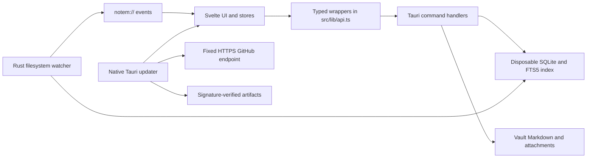

# Architecture

NoteM is a Tauri 2 desktop application with a Svelte 5/TypeScript frontend and a Rust backend. It is designed around a plain-folder Markdown vault and a disposable SQLite search index.

## Data flow

The frontend owns presentation and in-memory workspace state. Rust owns filesystem access, path validation, indexing, file watching, settings persistence, and operating-system integration.

## Vault and identity

A vault is an ordinary directory. Markdown files and attachments are durable user data. Note identity is the vault-relative path without the `.md` extension; internal paths use `/` on every platform.

`<vault>/.notem/index.db` stores derived file metadata, links, tags, headings, frontmatter values, and FTS text. `<vault>/.notem/settings.json` stores vault-specific workspace state. Deleting `.notem/` must never delete or invalidate source notes; opening the vault rebuilds the index.

## Rust backend

`src-tauri/src/commands/` groups the Tauri IPC surface by responsibility:

- `vault.rs` opens vaults and returns the visible tree.
- `files.rs` handles note, folder, attachment, import, reveal, and external-open operations.
- `search.rs`, `links.rs`, and `tags.rs` query derived knowledge metadata.
- `frontmatter.rs` reads and rewrites ordered YAML properties.
- `settings.rs` persists application and vault settings.
- `updater.rs` reports whether the current installation supports automatic
  update installation; updater checks and installs remain behind the native
  Tauri updater plugin.
- `index.rs`, `performance.rs`, `startup.rs`, and `window.rs` expose supporting lifecycle behavior.

`src-tauri/src/vault_path.rs` is the filesystem containment boundary. Commands use it to canonicalize the vault, reject traversal and symlink escapes, and safely resolve existing or new destinations. The security assumptions and residual pathname race are documented in [THREAT_MODEL.md](THREAT_MODEL.md).

`src-tauri/src/index/` contains SQLite schema/setup, Markdown parsing, full scans, and the debounced filesystem watcher. File mutations update the index synchronously; external changes are indexed by the watcher and emitted to the frontend.

## Frontend

`src/lib/api.ts` is the only frontend module that directly invokes Tauri commands. Components consume typed wrappers and state from the Svelte stores:

- `vault.svelte.ts` owns the open vault, tree, loaded files, dirty state, and conflicts.
- `ui.svelte.ts` owns panes, tabs, navigation history, reading/editing state, and workspace persistence.
- `settings.svelte.ts` owns application preferences and editor settings.
- `updater/client.ts` isolates native updater, process, and application-version
  APIs; `updater.svelte.ts` owns typed update state and testable actions.
- `graph.svelte.ts` owns graph queries and graph-view state.

CodeMirror extensions live under `src/lib/editor/`; Markdown rendering and plugins live under `src/lib/markdown/`; Canvas graph rendering lives under `src/lib/graph/`. PDF.js is loaded lazily and uses bundled workers, fonts, character maps, and WASM resources.

## Events and consistency

Rust emits `notem://file-changed`, `notem://index-updated`, progress, and vault-availability events. The frontend reacts by refreshing the tree, metadata panes, and active content as appropriate. External edits that conflict with unsaved local content require an explicit user choice.

SQLite is never authoritative for notes. Schema mismatch, corruption, or deletion is handled by recreating the derived index from files.

Updater checks are not triggered during application startup in this phase.
When invoked, the native updater uses the configured HTTPS endpoint and
embedded public key; update notes remain plain text in frontend state. Linux
DEB and other non-AppImage installations expose a manual-download path because
the Tauri updater cannot replace them in place.

## Security boundaries

Vault contents are untrusted input. Raw Markdown HTML is disabled, rendered links use explicit destination allowlists, production CSP blocks remote content, and detached note windows receive narrower Tauri capabilities than the main window. Any change that broadens URL handling, IPC, asset scope, filesystem access, or webview content must update tests and [THREAT_MODEL.md](THREAT_MODEL.md).
